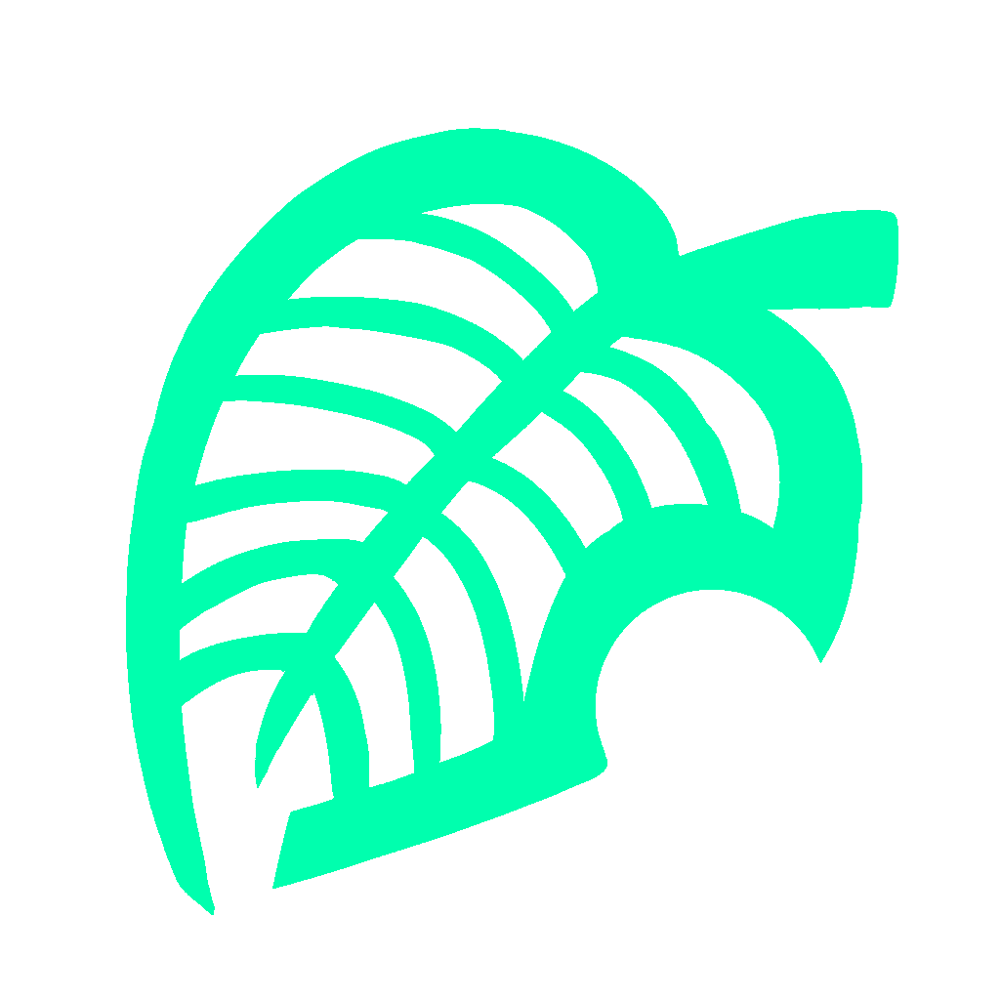

<!-- PROJECT LOGO -->
<br />
<div align="center">
  <a href="https://github.com/crbilladeau/watcher">
    
  </a>
  <h2 align="center">New Horizons Companion</h3>

  <p align="center">
    An iOS app companion for the video game <i>Animal Crossing: New Horizons</i> released to the iOS App Store in May 2019. Written in React Native and built on Expo.
    <br />
    <br />
     
    <br />
  </p>
<h2 align="center">No longer available in the App Store</h2>
</div>

<!-- TABLE OF CONTENTS -->
<details open="open">
  <summary><h2 style="display: inline-block">Table of Contents</h2></summary>
  <ol>
    <li>
      <a href="#about-the-project">About The Project</a>
      <ul>
        <li><a href="#in-development">In Development</a></li>
      </ul>
      <ul>
        <li><a href="#built-with">Built With</a></li>
      </ul>
    </li>
    <li>
      <a href="#getting-started">Getting Started</a>
      <ul>
        <li><a href="#prerequisites">Prerequisites</a></li>
        <li><a href="#installation">Installation</a></li>
      </ul>
    </li>
    <li><a href="#contributing">Contributing</a></li>
    <li><a href="#license">License</a></li>
    <li><a href="#contact">Contact</a></li>
  </ol>
</details>


<!-- ABOUT THE PROJECT -->
## About The Project

<div align="center">
   <div style="display: flex; align-items: flex-start;">
     
     
  </div>
  <br />
</div>


**The New Horizons Companion App** is an iOS app written in **React Native** and built on **Expo**. It features:

* Live searching, alphabetical sorting, and button filtering for sorting villagers by species, personality, and style
* Interactive pop-out modal for information on villagers, creatures, and events
* Mobile push notifications that will send notifications on the day of a specific event

This was my first attempt working with React Native and Expo specifically, after only working with React exclusively for several years. It is also my first mobile app, and the first one I published to the App Store.

### In Development

* Making more components reusable
* Updating Events

### Built With

* [React Native](https://reactnative.dev/)
* [Expo](https://expo.io/)
* [lodash](https://lodash.com/)
* [moment](https://momentjs.com/)

<!-- GETTING STARTED -->
## Getting Started

To get a local copy up and running follow these simple steps.

### Prerequisites

This is an example of how to list things you need to use the software and how to install them.
* npm
  ```sh
  npm install npm@latest -g
  ```

### Installation

1. Clone the repo
   ```sh
   git clone https://github.com/github_username/repo_name.git
   ```
2. Install NPM packages
   ```sh
   npm install
   ```


<!-- CONTRIBUTING -->
## Contributing

1. Fork the Project
2. Create your Feature Branch (`git checkout -b feature/AmazingFeature`)
3. Commit your Changes (`git commit -m 'Add some AmazingFeature'`)
4. Push to the Branch (`git push origin feature/AmazingFeature`)
5. Open a Pull Request


<!-- CONTACT -->
## Contact

Your Name - [@crbilladeau](https://twitter.com/crbilladeau) - charlie.billadeau@gmail.com

Project Link: [https://github.com/crbilladeau/new-horizons-companion](https://github.com/crbilladeau/new-horizons-companion)

